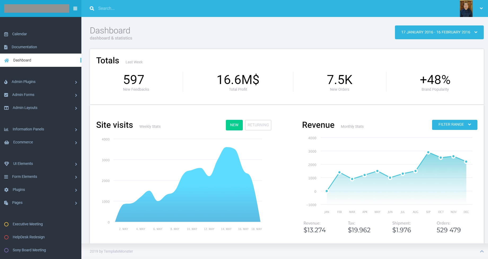

# frontend_interview_prompt
This is the homework assignment given to prospective frontend engineers. This task should not take more than 4 hours of your time. This prompt itself should last 3.5 hours, with half an hour to fill out the remaining questions on this README. 

## Task
Create a dashboard as close as possible to the following image: 

The graphs underneath <strong> Site Visits </strong> and <strong> Revenue </strong> can be placeholder images and any image that you see fit. 

## Getting started

Fork this project and clone it into your own repository. 

Please use any front-end framework you are comfortable with. 
We suggest getting started with [material-ui](https://material-ui.com/) as they have many of the the components pre-built. If you are using a different framework, there are usually equivalent libraries for material design. 

If you choose to start from scratch the font-type is: [Roboto](https://fonts.google.com/specimen/Roboto),

## Things we are looking for 
- [x] Are the margins and padding similar to the image? Were the colors close? 
- [x] Were clickable items accounted for with the right elements? e.g. (was a button or dropdown element used where it should have been used)
- [x] How was the project set up? 
- [x] If deviations to the design were made, were they justified? 

### Going above and beyond
Before moving onto these, please make sure you are happy with the overall look of your dashboard already! 
- [x] Use your best judgement to make the dashboard responsive and collapsible at 1200px breakpoint. 
      - The lefthand drawer should collapse at 1200px.  
      - The "Totals" Section should collapse to a 2x2 block
      - The two graph blocks should stack. 

- [ ] If you have extra time, replace the placeholder images with dummy data and graphs from a visualization library like C3, D3, or React Vis. The filters on the graph do not have to work, but please share below if you had more time what you would filter on. 

- [ ] Replace the `Totals` section with data from the following endpoint with a new request being made each refresh: http://www.mocky.io/v2/5d018fbd3100005400ab2968, use your best judgement how to handle this new data. 

## Questions To Answer: 

This is your chance to talk about the prompt! Please provide these answers on your README. 

Live Netlify link of take home project: [Luxury Test](https://luxury-test.netlify.com/)

- Please share your screen resolution, OS, browser version (best if you're using latest) you used to test in so we can look at it in:
     - Screen resolution is 1920x1080 and browser version is Google Chrome 75. 
     - Browser resolution developed in 1858x1080. 
     - OS is Windows 10.0.17763 Build 17763
- What part of the design did you get stuck on? What took the most time? Similarly, what was the easiest part? 
     - I had a hard time creating the creating the designs and making sure the imported Font Awesome icons were aligned correctly to its neighboring content. 
     - In addition, another hard part I encountered was the collapsible 2x2 section because the vertical borders separating the four sections were out of alignment and not to my liking. 
     - The part I've spent the most time on the design is the Dashboard. I spent a great majority structuring the content and building blocks around each other while keeping in mind of the collapsible 2x2 section and graph stacking when viewport is < 1200px. I ended up trying to refactor some of the CSS I used and that took a long time for the dashboard feature
     - Easiest part was the navbars. Navbars were simple and did not have a lot of content in comparison to the Dashboard + graphs
- What part of the design didn't make sense? Did you change anything?
     - First design that did not make sense was the overlapping of the footer on the dashboard, I ended up choosing to remove the small section belonging to the dashboard in favor of showing the height of the footer section.
- If you had more time, what would you have liked to implement? 
     - If I had more time, there were a lot of work I would love to finish up. First, the site is not very mobile-friendly and a lot of section overlap with eachother
     - I wish to implement the cog wheel with a spinning animation on the side and have the cog wheel appear in full when hovering over it
     - If I had more time, I knew I could have implemented the mock data with a lifecycle, componentDidMount() and fetch API. A little bit of parsing the data into JSON, placing them as component state values, and injecting them into the section where needed.
- What did you have to research or lookup while working on this? 
     - I've never used the Material-UI library and looking back to it, I believe I could have created the same site without Material UI in my honest opinion. I ended up researching and reading the Material UI documentation and given my dev workflow, I was not using features of Material UI to my advantage due to time. Some CSS imports from Material UI library conflicted wtih the overall expectation of my site
     - Adding on, I was unfamiliar with Material-UI icon library. After spending more than 30 minutes trying to retrieve the icons, I switched to Font Awesome because they had more options and had everything I needed on the sidebar.

